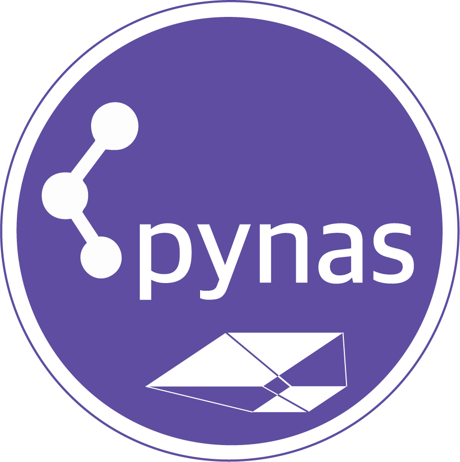
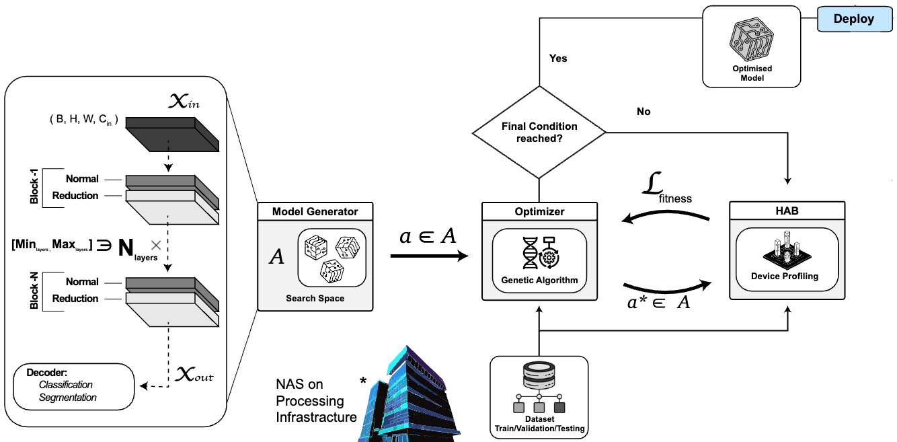

[](https://www.python.org/downloads/)
[](https://github.com/ESA-PhiLab/pynas/wiki)
[](https://makeapullrequest.com)
[](https://doi.org/10.5281/zenodo.15332053)
[](https://www.gnu.org/licenses/gpl-3.0)


<p align="right">

</p>

### > powered by:

<p align="center">
    
</p>


# 🧬 pynas

PyNAS is a modular neural architecture search (NAS) framework developed by ESA Φ-lab and Little Place Lab, specifically designed for deployment optimization on edge devices. It leverages advanced metaheuristic strategies, primarily Genetic Algorithms (GA) 🧬, to efficiently identify optimal deep learning architectures for constrained environments.

### Key Features
- 🧬 Metaheuristic Optimisation: Utilizes Genetic Algorithms (GA) for robust architecture optimization.
- 🔍 Model Architecture Selection: Automates the selection of optimal architectures for specific onboard applications.
- 📱 Edge Device Compatibility: Tailored for efficient deployment on various edge devices.
- 📊 Performance Metrics: Evaluates architectures based on predefined or custom metrics relevant to edge computing.


> [!WARNING] 🚧 Work In Progress: 
> This repository currently contains a limited preview of the PyNAS framework. The complete codebase will be publicly disclosed upon the acceptance of our research paper. We appreciate your interest and patience.


&nbsp;

| Feature | Description |
|---------|-------------|
|  |  |
| Python Support | [](https://www.python.org/downloads/) |
| PyPi | Coming soon 🚧 |
| License | [](https://www.gnu.org/licenses/gpl-3.0) |
| Documentation | Coming soon 🚧 |
| Contributions | [](https://makeapullrequest.com) |


## 👥 Authors

 - Roberto Del Prete 🎓 ([Google Scholar](https://scholar.google.com/citations?user=Dwc8YxwAAAAJ))
 - Parampuneet Thind 🤖 ([Google Scholar](https://scholar.google.com/citations?user=Q71ynAkAAAAJ&hl=en&oi=sra))
 - Andrea Mazzeo 🧠 
 - Lorenzo Papa 🛰️ ([Google Scholar](https://scholar.google.com/citations?user=P64hj-4AAAAJ))
 - Matthew Whitley 📡 
 - Gabriele Meoni 🔬 ([Google Scholar](https://scholar.google.com/citations?user=vv34M9QAAAAJ))
 - Nicolas Longepe 🌍 ([Google Scholar](https://scholar.google.com/citations?user=YVVkIX8AAAAJ))

## 📖 Reference
Specify the type and context of the project.

- ESA Φ-lab Research Fellowship — [Link to ESA page](https://philab.esa.int)
- Little Place Lab — [Link to LPL page](https://www.littleplace.com)


## 📝 Abstract
Advancements in spaceborne edge computing has facilitated the incorporation of AI-powered chips into CubeSats, allowing for intelligent data handling and enhanced analytical capabilities with greater operational autonomy.
This class of satellites face stringent energy and memory constraints, thus necessitating lightweight models which are often obtained by compression techniques.
This paper addresses model compression by Neural Architecture Search (NAS) to enable computational efficiency and balance between accuracy, size, and latency.
More in detail, we design an evolutionary-based NAS framework for onboard processing and test its capabilities on the burned area segmentation test case. The proposed solution jointly optimizes network architecture and deployment for hardware-specific resource-constrained platforms. Additionally, hardware-awareness is introduced in the optimization loop for tailoring the network topology to the specific target edge computing chip.
The resulting models, which has been designed on CubeSat-class hardware, i.e. an NVIDIA Jetson AGX Orion and the Intel Movidious Myriad X, exhibits a memory footprint below 1 MB, outperforming handcrafted baselines in terms of latency (3× faster) and maintain competitive mean Intersection over Union (mIoU); additionally enabling real-time, high-resolution inference in orbit.


<p align="center">
    
</p>

## 🛠️ How to Use
Detailed instructions to set up and run the project.

### Requirements
This repository uses a modern Python environment standard:
- Python ≥ 3.9
- Dependencies are specified in the `pyproject.toml` file.

To install:
```bash
pip install .
```
Or using PDM:
```bash
pdm install
```

## 📚 Citations
Please cite the following works if you use this code:


## 📂 Repository Structure
```
├── LICENSE
├── README.md
├── pyproject.toml      # project metadata & dependencies
├── setup.cfg           # optional packaging config
├── environment.yml     # optional environment specification
├── src/                # source code & Python package
│   └── your_package/   # replace with your package name
├── notebooks/          # Jupyter notebooks for experiments or analysis
├── papers/             # manuscript sources (LaTeX, figures, assets)
├── data/               # raw/processed datasets or external links
├── scripts/            # utility scripts and entry points
├── tests/              # unit and integration tests
├── docs/               # documentation (Sphinx, MkDocs, GitHub Pages)
│   ├── index.html      # main documentation page
│   ├── images/         # documentation assets (images,..)
└── examples/           # usage examples and demos
```

The `docs/` directory contains the project's documentation website with comprehensive information about the project, including:
- Project overview and goals
- Installation and setup instructions
- Usage examples and tutorials
- API documentation
- Links to related resources and publications
- Team and contributor information


## 📄 License
This project is licensed under the **CC BY-NC-ND 4.0** license. See the [LICENSE](./LICENSE) file or read more at [creativecommons.org](https://creativecommons.org/licenses/by-nc-nd/4.0/).

## 📊 Dataset Hosting

All relevant data supporting the findings of this study are either included in the manuscript and supplementary materials or are publicly available at: 

- [Hugging Face](https://huggingface.co/datasets/ESA-PhiLab-Edge/LPL-Burned-Area-Seg)


### 📥 Data Download Utilities

This repository includes a utility script for downloading datasets or models from the Hugging Face Hub:

```python
# Install required dependencies
pip install huggingface_hub

# Run the download script
python data/download_hf_datasets.py
```

The script (`data/download_hf_datasets.py`) provides a robust way to fetch datasets with automatic retries and error handling. It uses the `huggingface_hub` library to download repositories with the following features:

- Downloads datasets or models from Hugging Face Hub
- Configurable retry mechanism for handling network issues
- Progress tracking and error reporting
- Supports custom local directories for downloads
- Uses HF's optimized transfer protocol

To customize which datasets to download, edit the `repo_ids` list in the script.
